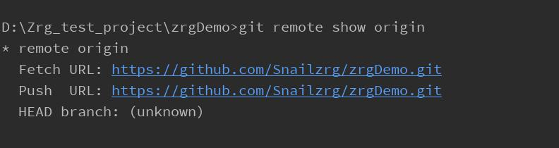
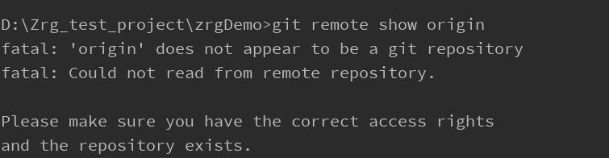

from ：

三、上传本地文件到github上
一、基础知识补充
1、git init #把这个目录变成Git可以管理的仓库

2、git add README.md #本地README.md文件添加到远程仓库

3、git add . #不但可以跟单一文件，还可以跟通配符，更可以跟目录。一个点就把当前目录下所有未追踪的文件全部add了，注意空格

4、git commit -m “注释” #把文件提交到仓库

5、git remote add origin git@github.com:heimu24/blog-backup.git #本地关联远程仓库

6、git push -u origin master #把本地库的所有内容推送到远程库上（第一次需要加-u，后面就不用加了）

-------

查看本地仓库关联的远程仓库信息 命令：git remote show origin !

2、第二步

如果项目未关联过其他远程仓库执行  git remote add origin https://gitee.com/*****/xj_job.git

如果项目一关联过其他远程分支执行 git remote set-url origin https://gitee.com/*****/xj_job.git

3、第三步

关联本地分关联远程仓库分支执行 

git branch --set-upstream-to=origin/master(远程分支) master(本地分支)--allow-unrelated-histories

关联成功后，拉去远程仓库分支执行 git pull --allow-unrelated-histories 

推送本地分支到远程分支  git push
