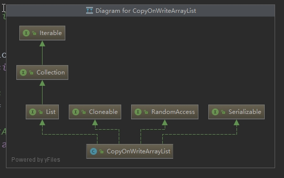

# CopyOnWriteArrayList源码分析

CopyOnWriteArrayList实现了List, RandomAccess, Cloneable, java.io.Serializable等接口。
CopyOnWriteArrayList实现了List，提供了基础的添加、删除、遍历等操作。
CopyOnWriteArrayList实现了RandomAccess，提供了随机访问的能力。
CopyOnWriteArrayList实现了Cloneable，可以被克隆。
CopyOnWriteArrayList实现了Serializable，可以被序列化。

  属性

      /*** 用于修改时加锁  使用transient修饰表示不自动序列化 **/
    final transient ReentrantLock lock = new ReentrantLock();

    /** The array, accessed only via getArray/setArray. 真正存储元素的地方，只能通过getArray()/setArray()访问  使用transient修饰表示不自动序列化，使用volatile修饰表示一个线程对这个字段的修改另外一个线程立即可见*/
    private transient volatile Object[] array;

构造方法
       
       // 所有对array的操作都是通过setArray()和getArray()进行     
     public CopyOnWriteArrayList() {
        setArray(new Object[0]);
    }

CopyOnWriteArrayList(Collection c)构造方法
如果c是CopyOnWriteArrayList类型，直接把它的数组赋值给当前list的数组，注意这里是浅拷贝，两个集合共用同一个数组。
如果c不是CopyOnWriteArrayList类型，则进行拷贝把c的元素全部拷贝到当前list的数组中

    public CopyOnWriteArrayList(Collection<? extends E> c) {
        Object[] elements;
        // 如果c也是CopyOnWriteArrayList类型 那么直接把它的数组拿过来使用
        if (c.getClass() == CopyOnWriteArrayList.class)
            elements = ((CopyOnWriteArrayList<?>)c).getArray();
        else {
        //否则调用其toArray()方法将集合元素转化为数组
            elements = c.toArray();
            // c.toArray might (incorrectly) not return Object[] (see 6260652)  这里c.toArray()返回的不一定是Object[]类型  同ArrayList 情形 详见 ArrayList
            if (elements.getClass() != Object[].class)
                elements = Arrays.copyOf(elements, elements.length, Object[].class);
        }
        setArray(elements);
    }

把toCopyIn的元素拷贝给当前list的数组。

     public CopyOnWriteArrayList(E[] toCopyIn) {
        setArray(Arrays.copyOf(toCopyIn, toCopyIn.length, Object[].class));
    }

add(E e)方法
添加一个元素到末尾。 先加锁 再将旧数据拷贝一份  新数组大小+1 最后 一个 指向新增的·元素

     public boolean add(E e) {
     // 加锁
        final ReentrantLock lock = this.lock;
        lock.lock();
        try {
        //获取旧数组
            Object[] elements = getArray();
            int len = elements.length;
            //将旧数组元素拷贝到新数组中  新数组大小是旧数组大小加1
            Object[] newElements = Arrays.copyOf(elements, len + 1);
            // 将元素放在最后一位
            newElements[len] = e;
            setArray(newElements);
            return true;
        } finally {
        // 释放锁
            lock.unlock();
        }
    }

add(int index, E element)方法
添加一个元素在指定索引处。

    public void add(int index, E element) {
        final ReentrantLock lock = this.lock;
        lock.lock();
        try {
            Object[] elements = getArray();
            int len = elements.length;
            // 检查是否越界, 可以等于len
            if (index > len || index < 0)
                throw new IndexOutOfBoundsException("Index: "+index+
                                                    ", Size: "+len);
            Object[] newElements;
            int numMoved = len - index;
            if (numMoved == 0)
             // 如果插入的位置是最后一位  那么拷贝一个n+1的数组, 其前n个元素与旧数组一致
                newElements = Arrays.copyOf(elements, len + 1);
            else {
                // 如果插入的位置不是最后一位 那么新建一个n+1的数组
                newElements = new Object[len + 1];
                // 拷贝旧数组前index的元素到新数组中
                System.arraycopy(elements, 0, newElements, 0, index);
                // 将index及其之后的元素往后挪一位拷贝到新数组中  这样正好index位置是空出来的
                System.arraycopy(elements, index, newElements, index + 1,
                                 numMoved);
            }
            // 将元素放置在index处
            newElements[index] = element;
            setArray(newElements);
        } finally {
            lock.unlock();
        }
    }

（1）加锁；
（2）检查索引是否合法，如果不合法抛出IndexOutOfBoundsException异常，注意这里index等于len也是合法的；
（3）如果索引等于数组长度（也就是数组最后一位再加1），那就拷贝一个len+1的数组；
（4）如果索引不等于数组长度，那就新建一个len+1的数组，并按索引位置分成两部分，索引之前（不包含）的部分拷贝到新数组索引之前（不包含）的部分，索引之后（包含）的位置拷贝到新数组索引之后（不包含）的位置，索引所在位置留空；
（5）把索引位置赋值为待添加的元素；
（6）把新数组赋值给当前对象的array属性，覆盖原数组；
（7）解锁；

addIfAbsent(E e)  Appends the element, if not present.   新增一个元素 看是否存在

     public boolean addIfAbsent(E e) {
     // 快照 先获取元素 如果 添加的元素存在 返回false  否则 返回 true
        Object[] snapshot = getArray();
        return indexOf(e, snapshot, 0, snapshot.length) >= 0 ? false :
            addIfAbsent(e, snapshot);
    }

    private boolean addIfAbsent(E e, Object[] snapshot) {
        final ReentrantLock lock = this.lock;
        lock.lock();
        try {
            Object[] current = getArray();
            int len = current.length;
            if (snapshot != current) {
                // Optimize for lost race to another addXXX operation
                int common = Math.min(snapshot.length, len);
                for (int i = 0; i < common; i++)
                    if (current[i] != snapshot[i] && eq(e, current[i]))
                        return false;
                if (indexOf(e, current, common, len) >= 0)
                        return false;
            }
            Object[] newElements = Arrays.copyOf(current, len + 1);
            newElements[len] = e;
            setArray(newElements);
            return true;
        } finally {
            lock.unlock();
        }
    }

