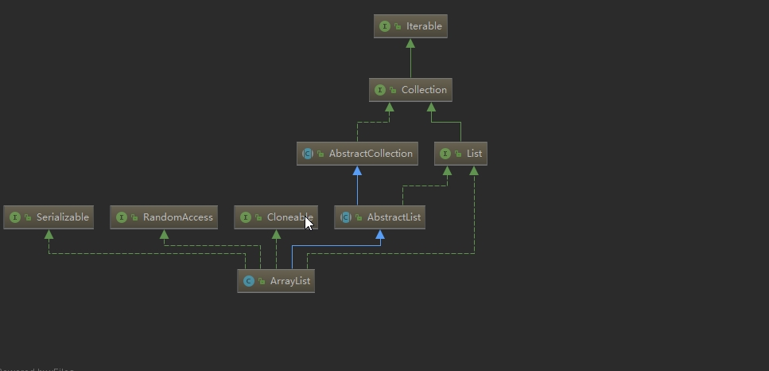

# 1. ArrayList源码分析

ArrayList是一种以数组实现的List，与数组相比，它具有动态扩展的能力，因此也可称之为动态数组。

  1-） ArrayList实现了List, RandomAccess, Cloneable, java.io.Serializable等接口。
  2-）ArrayList实现了List，提供了基础的添加、删除、遍历等操作。
  3-）ArrayList实现了RandomAccess，提供了随机访问的能力。
  4-）ArrayList实现了Cloneable，可以被克隆。
  5-）ArrayList实现了Serializable，可以被序列化。

 /**ArrayList 属性   ***/
   
     /**
     * Default initial capacity.  默认容量
     */
    private static final int DEFAULT_CAPACITY = 10;

    /**
     * Shared empty array instance used for empty instances. 空数组，如果传入的容量为0时使用
     */
    private static final Object[] EMPTY_ELEMENTDATA = {}; 

    /**
     * 存储元素的数组
     */
    transient Object[] elementData; // non-private to simplify nested class access

    /**
     * The size of the ArrayList (the number of elements it contains).
     *    集合中元素的个数
     * @serial
     */
    private int size;
 
 （1）DEFAULT_CAPACITY
默认容量为10，也就是通过new ArrayList()创建时的默认容量。

（2）EMPTY_ELEMENTDATA
空的数组，这种是通过new ArrayList(0)创建时用的是这个空数组。

（3）DEFAULTCAPACITY_EMPTY_ELEMENTDATA
也是空数组，这种是通过new ArrayList()创建时用的是这个空数组，与EMPTY_ELEMENTDATA的区别是在添加第一个元素时使用这个空数组的会初始化为DEFAULT_CAPACITY（10）个元素。

（4）elementData
真正存放元素的地方，使用transient是为了不序列化这个字段。
至于没有使用private修饰，后面注释是写的“为了简化嵌套类的访问”，但是楼主实测加了private嵌套类一样可以访问。
private表示是类私有的属性，只要是在这个类内部都可以访问，嵌套类或者内部类也是在类的内部，所以也可以访问类的私有成员。

（5）size
真正存储元素的个数，而不是elementData数组的长度。

ArrayList(int initialCapacity)构造方法

传入初始容量，如果大于0就初始化elementData为对应大小，如果等于0就使用EMPTY_ELEMENTDATA空数组，如果小于0抛出异常。

/**ArrayList 构造方法   ***/

     public ArrayList(int initialCapacity) {
        super();
        if (initialCapacity < 0)
            throw new IllegalArgumentException("Illegal Capacity: "+
                                               initialCapacity);
        this.elementData = new Object[initialCapacity];
    }

     public ArrayList() {
        super();
        this.elementData = EMPTY_ELEMENTDATA;
    }

ArrayList(Collection c)构造方法
传入集合并初始化elementData，这里会使用拷贝把传入集合的元素拷贝到elementData数组中，如果元素个数为0，则初始化为EMPTY_ELEMENTDATA空数组。

      public ArrayList(Collection<? extends E> c) {
        elementData = c.toArray();
        size = elementData.length;
        // 为什么 c.toArray();返回的有可能不是Object[]类型呢？请看下面的代码
        // c.toArray might (incorrectly) not return Object[] (see 6260652)
        if (elementData.getClass() != Object[].class)
            elementData = Arrays.copyOf(elementData, size, Object[].class);
    }

   /**  6260652 JDK  bug库中的编号  c.toArray();返回的有可能不是Object[]类型  ArrayList 的c.toArray();返回的是Object[]类型   ***/
   
     @Test
    public  void test1()
    {
        SubClass[] subArray = {new SubClass(), new SubClass()};
        System.out.println(subArray.getClass());

        // class [Lcollection.SubClass; java对象的向上转型，子类数组转换成父类数组是允许的
        BaseClass[] baseArray = subArray;
        System.out.println(baseArray.getClass());

        /*
         * java.lang.ArrayStoreException
         * 但是由于数组中元素类型都是SubClass类型的，所以 baseArray[0] = new BaseClass();会报错
         * 这也就是说假如我们有1个Object[]数组，并不代表着我们可以将Object对象存进去，这取决于数组中元素实际的类型
         */
        System.out.println(baseArray[0].getClass());
        baseArray[0] = new BaseClass();
    }

    @Test
    public  void test2()
    {
        List<String> list = Arrays.asList("abc");

        // class java.util.Arrays$ArrayList
        System.out.println(list.getClass());

        // class [Ljava.lang.String;
        Object[] objArray = list.toArray();
        System.out.println(objArray.getClass());

        /*
         * objArray[0] 里面的其实是String 类型 返回是String[]数组，所以我们不能将Object对象，放到objArray数组中
         */
        System.out.println( objArray[0].getClass());
        objArray[0] = new Object(); // cause ArrayStoreException  "123"

    }

    @Test
    public  void test3()
    {
        List<String> dataList = new ArrayList<String>();
        dataList.add("one");
        dataList.add("two");

        /**
         * ArrayList对象的toArray()返回就是Object[]数组，所以我们可以将任意对象存放到返回的Object[]数组中。
         * 通过test2和test3可以看出，如果我们有1个List<String> stringList对象，当我么调用Object[] objectArray = stringList.toArray();的时候，
         * objectArray 并不一定能够放置Object对象。这就是源码中的注释：c.toArray might (incorrectly) not return Object[] (see 6260652)。
         * 为了考虑这种情况，所以源码中进行了if判断，来防止错误的数组对象导致异常。Arrays.copyOf(elementData, size, Object[].class);
         * 这个方法就是用来创建1个Object[]数组，这样数组中就可以存放任意对象了。
         */
        Object[] listToArray = dataList.toArray();

        // class [Ljava.lang.Object;返回的是Object数组
        System.out.println(listToArray.getClass());
        listToArray[0] = "";
        listToArray[0] = 123;
        listToArray[0] = new Object();

    }

/*** 方法 ***/
*    add(E e)方法*
添加元素到末尾，平均时间复杂度为O(1)。

     public boolean add(E e) {
        ensureCapacityInternal(size + 1);  // Increments modCount!!
        elementData[size++] = e;
        return true;
     }

    private void ensureCapacityInternal(int minCapacity) {
        if (elementData == EMPTY_ELEMENTDATA) {
            minCapacity = Math.max(DEFAULT_CAPACITY, minCapacity);
        }
        ensureExplicitCapacity(minCapacity);
    }

    private void ensureExplicitCapacity(int minCapacity) {
        modCount++;
        // overflow-conscious code
        if (minCapacity - elementData.length > 0)   
        // 扩容
        grow(minCapacity);
    }
    
    
    private void grow(int minCapacity) {
        // overflow-conscious code
        int oldCapacity = elementData.length;
        // 新容量为旧容量的1.5倍
        int newCapacity = oldCapacity + (oldCapacity >> 1);
        // 如果新容量发现比需要的容量还小，则以需要的容量为准
        if (newCapacity - minCapacity < 0)
            newCapacity = minCapacity;
            
        // 如果新容量已经超过最大容量了，则使用最大容量
        if (newCapacity - MAX_ARRAY_SIZE > 0)
            newCapacity = hugeCapacity(minCapacity);
        // minCapacity is usually close to size, so this is a win:
         
        // 以新容量拷贝出来一个新数组
        elementData = Arrays.copyOf(elementData, newCapacity);
    }

（1）检查是否需要扩容；                                                                                                                                                                                                                                                
（2）如果elementData等于DEFAULTCAPACITY_EMPTY_ELEMENTDATA则初始化容量大小为DEFAULT_CAPACITY；                                                                                                           
（3）新容量是老容量的1.5倍（oldCapacity + (oldCapacity >> 1)），如果加了这么多容量发现比需要的容量还小，则以需要的容量为准；                                                                                
（4）创建新容量的数组并把老数组拷贝到新数组；

   *add(int index, E element)方法*
    添加元素到指定位置，平均时间复杂度为O(n)。

     public void add(int index, E element) {
         // 是否越界 检查
        rangeCheckForAdd(index);
        //  是否扩容 
        ensureCapacityInternal(size + 1);  // Increments modCount!!
        //  将inex及其之后的元素往后挪一位，则index位置处就空出来了
        System.arraycopy(elementData, index, elementData, index + 1,
                         size - index);
        elementData[index] = element;
        size++;
    }

（1）检查索引是否越界；                                                                                                             
（2）检查是否需要扩容；                                                                                                             
（3）把插入索引位置后的元素都往后挪一位；                                                                                
（4）在插入索引位置放置插入的元素；                                                                                          
（5）大小加1；                                                                                                                           

  
  /**addAll(Collection c)方法**/
    求两个集合的并集。  
     
     public boolean addAll(Collection<? extends E> c) {
        // 将集合c转为数组
        Object[] a = c.toArray();
        int numNew = a.length;
        // 检查是否需要扩
        ensureCapacityInternal(size + numNew);  // Increments modCount
        // 将c中元素全部拷贝到数组的最后
        System.arraycopy(a, 0, elementData, size, numNew);  
        // 大小增加c的大小
        size += numNew;
        // 如果c不为空就返回true，否则返回false    
        return numNew != 0;
    }
    
（1）拷贝c中的元素到数组a中；
（2）检查是否需要扩容；
（3）把数组a中的元素拷贝到elementData的尾部；

     public boolean addAll(int index, Collection<? extends E> c) {
            // 是否越界 检查
            rangeCheckForAdd(index);
            int cSize = c.size();
            // 新增 空数组
            if (cSize==0)
                return false;
            checkForComodification();
            parent.addAll(parentOffset + index, c);
            this.modCount = parent.modCount;
            this.size += cSize;
            return true;
        }

  //--->  https://blog.csdn.net/weixin_40254498/article/details/81386920    checkForComodification 详解

 /**  get(int index)方法 **/
        获取指定索引位置的元素，时间复杂度为O(1)。

    public E get(int index) {
        rangeCheck(index);
        return elementData(index);
    }

（1）检查索引是否越界，这里只检查是否越上界，如果越上界抛出IndexOutOfBoundsException异常，如果越下界抛出的是ArrayIndexOutOfBoundsException异常。                                              
（2）返回索引位置处的元素；

 /**  remove(int index)方法 **/
删除指定索引位置的元素，时间复杂度为O(n)。

     public E remove(int index) {
        rangeCheck(index);
        // modCount------->
        modCount++;
        E oldValue = elementData(index);
        // 如果index不是最后一位，则将index之后的元素往前挪
        int numMoved = size - index - 1;
        if (numMoved > 0)
            System.arraycopy(elementData, index+1, elementData, index,
                             numMoved);
                              
        // 将最后一个元素删除，帮助GC
        elementData[--size] = null; // clear to let GC do its work
        // 返回旧值
        return oldValue;
    }

（1）检查索引是否越界；
（2）获取指定索引位置的元素；
（3）如果删除的不是最后一位，则其它元素往前移一位；
（4）将最后一位置为null，方便GC回收；
（5）返回删除的元素。
可以看到，ArrayList删除元素的时候并没有缩容。

 /** remove(Object o)方法 **/
删除指定元素值的元素，时间复杂度为O(n)。

      public boolean remove(Object o) {
        if (o == null) {
        // 遍历整个数组，找到元素第一次出现的位置，并将其快速删除
            for (int index = 0; index < size; index++)
            // 如果要删除的元素为null，则以null进行比较，使用==
                if (elementData[index] == null) {
                    fastRemove(index);
                    return true;
                }
        } else {
            for (int index = 0; index < size; index++)
            //如果要删除的元素不为null，则进行比较，使用equals()方法
                if (o.equals(elementData[index])) {
                    fastRemove(index);
                    return true;
                }
        }
        return false;
    }

     /*
     *  少了一个越界的检查
     * Private remove method that skips bounds checking and does not
     * return the value removed.
     */
    private void fastRemove(int index) {
        modCount++;
        int numMoved = size - index - 1;
        if (numMoved > 0)
            System.arraycopy(elementData, index+1, elementData, index,
                             numMoved);
        elementData[--size] = null; // clear to let GC do its work
    }

（1）找到第一个等于指定元素值的元素；
（2）快速删除；
fastRemove(int index)相对于remove(int index)少了检查索引越界的操作，可见jdk将性能优化到极致。

总结
（1）ArrayList内部使用数组存储元素，当数组长度不够时进行扩容，每次加一半的空间，ArrayList不会进行缩容；
（2）ArrayList支持随机访问，通过索引访问元素极快，时间复杂度为O(1)；
（3）ArrayList添加元素到尾部极快，平均时间复杂度为O(1)；
（4）ArrayList添加元素到中间比较慢，因为要搬移元素，平均时间复杂度为O(n)；
（5）ArrayList从尾部删除元素极快，时间复杂度为O(1)；
（6）ArrayList从中间删除元素比较慢，因为要搬移元素，平均时间复杂度为O(n)；
（7）ArrayList支持求并集，调用addAll(Collection c)方法即可；
（8）ArrayList支持求交集，调用retainAll(Collection c)方法即可；
（7）ArrayList支持求单向差集，调用removeAll(Collection c)方法即可；

  ** 彩蛋**
elementData设置成了transient，那ArrayList是怎么把元素序列化的呢？

     private void writeObject(java.io.ObjectOutputStream s)
        throws java.io.IOException{
        // Write out element count, and any hidden stuff  防止序列化期间有修改
        int expectedModCount = modCount;
        //  写出非transient非static属性（会写出size属性）
        s.defaultWriteObject();

        // Write out size as capacity for behavioural compatibility with clone()  写出元素个数
        s.writeInt(size);

        // Write out all elements in the proper order. 依次写出元素
        for (int i=0; i<size; i++) {
            s.writeObject(elementData[i]);
        }
        // 如果有修改，抛出异常
        if (modCount != expectedModCount) {
            throw new ConcurrentModificationException();
        }
    }

     private void readObject(java.io.ObjectInputStream s)
        throws java.io.IOException, ClassNotFoundException {
        // 声明为空数组
        elementData = EMPTY_ELEMENTDATA;

        // Read in size, and any hidden stuff  读入非transient非static属性（会读取size属性）
        s.defaultReadObject();

        // Read in capacity 读入元素个数，没什么用，只是因为写出的时候写了size属性，读的时候也要按顺序来读
        s.readInt(); // ignored

        if (size > 0) {
            // be like clone(), allocate array based upon size not capacity  计算容量 检查是否需要扩容
            ensureCapacityInternal(size);

            Object[] a = elementData;
            // Read in all elements in the proper order.
            for (int i=0; i<size; i++) {
                a[i] = s.readObject();
            }
        }
    }

  查看writeObject()方法可知，先调用s.defaultWriteObject()方法，再把size写入到流中，再把元素一个一个的写入到流中。
一般地，只要实现了Serializable接口即可自动序列化，writeObject()和readObject()是为了自己控制序列化的方式，这两个方法必须声明为private，在java.io.ObjectStreamClass#getPrivateMethod()方法中通过反射获取到writeObject()这个方法。
在ArrayList的writeObject()方法中先调用了s.defaultWriteObject()方法，这个方法是写入非static非transient的属性，在ArrayList中也就是size属性。同样地，在readObject()方法中先调用了s.defaultReadObject()方法解析出了size属性。
elementData定义为transient的优势，自己根据size序列化真实的元素，而不是根据数组的长度序列化元素，减少了空间占用。
