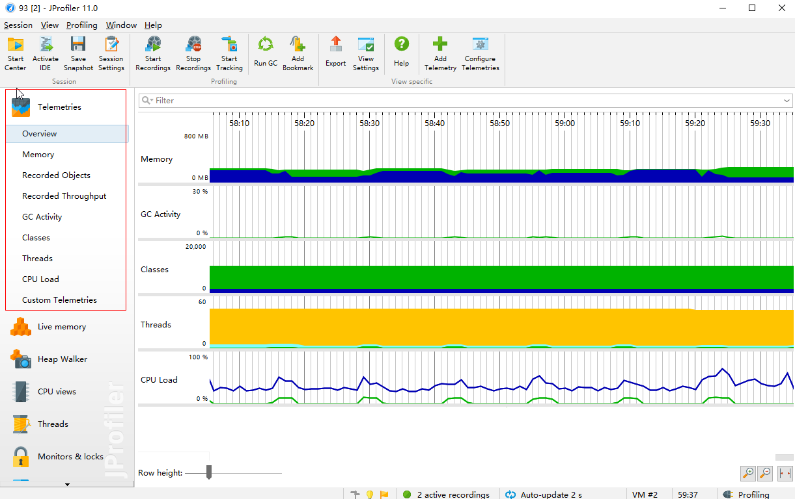

[toc]

#  安装 【未整理】

  好用的性能分析
 - [Jprofile安装](https://blog.csdn.net/vicky_pyh/article/details/88797514)

JProfiler是一个重量级的JVM监控工具，提供对JVM精确监控，其中堆遍历、CPU剖析、线程剖析看成定位当前系统瓶颈的得力工具。可以统计

压测过程中JVM的监控数据，定位性能问题。
JProfiler下载与安装 环境准备 JProfiler 17.1.5（IDEA插件） JProfiler 9.2（可执行软件） IntelliJ IDEA 2017.2.5 JProfiler插件安装 方式一： 直接在IDEA上下载File–Settings–plugins–Browse repositories ，找到jprofiler然后点击安装。

看到如下图片则说明安装完成

方式二： 从官网下载插件 官方下载地址：https://plugins.jetbrains.com/plugin/253-jprofiler
找到对应的版本下载就行。 然后把从下载的压缩包解压出来的JProfiler文件夹，copy到IDEA自定义插件目录，默认路径：C:\Users\Administrator.IntelliJIdea2017.2\config\plugins 同样看到如下图片则说明安装完成
启动完成会自动弹出JProfiler窗口，在里面就可以监控自己的代码性能了。

JRebel和JProfiler同时运行 如果IDEA中配置了JRebel热部署，要想JRebel和JProfiler同时运行，就要改手动管理JProfiler session了。 在 Run–Debug Configurations窗口JRebel Debug tab页中配置Environment Variables属性 CATALINA_OPTS：

-agentpath:D:\soft\jprofiler9\bin\windows-x64\jprofilerti.dll=port=8849,nowait,id=81,config=C:\Users\zoe.jprofiler9\config.xml

这里的port=8849就是安装JProfiler时设置的jprofiler监控端口。

然后启动Jrebel。

JProfiler功能说明 Telemetries(遥感勘测技术视图) 

Memory(内存) 显示堆栈的使用状况和堆栈尺寸大小活动时间表。 Recorded Objects（记录的对象） 显示一张关于活动对象与数组的图表的活动时间表。 Recorded Throughput （记录的生产量） 显示一段时间累计的JVM生产和释放的活动时间表。 GC Activity（垃圾回收活动） 显示一张关于垃圾回收活动的活动时间表。 Classes （类） 显示一个与已装载类的图表的活动时间表。 Threads （线程） 显示一个与动态线程图表的活动时间表。 CPU Load （CPU负载） 显示一段时间中CPU的负载图表。。 Live momery (内存视图)

JProfiler的内存视图部分可以提供动态的内存使用状况更新视图和显示关于内存分配状况信息的视图。所有的视图都有几个聚集层并且能够显示现有存在的对象和作为垃圾回收的对象。

All Objects (所有对象) 显示类或在状况统计和尺码信息堆上所有对象的包。你可以标记当前值并显示差异值。 Record Objects (记录对象 ) 显示类或所有已记录对象的包。你可以标记出当前值并且显示差异值。 Allocation Call Tree (分配访问树) 显示一棵请求树或者方法、类、包或对已选择类有带注释的分配信息的J2EE组件。 Allocation Hot Spots (分配热点) 显示一个列表，包括方法、类、包或分配已选类的J2EE组件。你可以标注当前值并且显示差异值。对于每个热点都可以显示它的跟踪记录树。 Class Tracker (类追踪器) 类跟踪视图可以包含任意数量的图表，显示选定的类和包的实例与时间。 Heap walker (堆遍历)

在JProfiler的堆遍历器(Heap Walker)中，你可以对堆的状况进行快照并且可以通过选择步骤下寻找感兴趣的对象。堆遍历器有五个视图.

Classes (类 ): 显示所有类和它们的实例，可以右击具体的类"Used Selected Instance"实现进一步跟踪。 Allocations(分配) 为所有记录对象显示分配树和分配热点。 References(索引) 为单个对象和“显示到垃圾回收根目录的路径”提供索引图的显示功能。还能提供合并输入视图和输出视图的功能。 Time(时间) 显示一个对已记录对象的解决时间的柱状图。 Inspections(检查 ) 显示了一个数量的操作，将分析当前对象集在某种条件下的子集，实质是一个筛选的过程。 -Graph(图表) 你需要在references视图和biggest视图手动添加对象到图表，它可以显示对象的传入和传出引用，能方便的找到垃圾收集器根源。 Ps:在工具栏点击"Go To Start"可以使堆内存重新计数，也就是回到初始状态。

CPU views(cpu视图)

JProfiler 提供不同的方法来记录访问树以优化性能和细节。线程或者线程组以及线程状况可以被所有的视图选择。所有的视图都可以聚集到方法、类、包或J2EE组件等不同层上。

Call Tree(访问树) 显示一个积累的自顶向下的树，树中包含所有在JVM中已记录的访问队列。JDBC,JMS和JNDI服务请求都被注释在请求树中。请求树可以根据Servlet和JSP对URL的不同需要进行拆分。 Hot Spots(热点) 显示消耗时间最多的方法的列表。对每个热点都能够显示回溯树。该热点可以按照方法请求，JDBC，JMS和JNDI服务请求以及按照URL请求来进行计算。 Call Graph（访问图） 显示一个从已选方法、类、包或J2EE组件开始的访问队列的图。 Method Statistis（方法统计） 显示一段时间内记录的方法的调用时间细节 Threads(线程视图)

JProfiler通过对线程历史的监控判断其运行状态，并监控是否有线程阻塞产生，还能将一个线程所管理的方法以树状形式呈现。对线程剖析。

Thread History(线程历史) 显示一个与线程活动和线程状态在一起的活动时间表。 Thread Monitor(线程监控) 显示一个列表，包括所有的活动线程以及它们目前的活动状况。 Thread Dumps(线程转储) 显示所有线程的堆栈跟踪。 Monitor &locks

Current Locking Graph (当前锁定图表) 显示JVM中的当前锁定情况。 Current Monitors (当前监视器) 显示当前正在等待或阻塞中的线程操作。 Locking History Graph(锁定历史图表) 显示记录在JVM中的锁定历史。 Monitor History(监控器历史) 显示等待或者阻塞的历史。 Monitor Usage Statistics(监控器使用统计) 计算统计监控器监控的数据。 Jprofiler应用 内存分析 系统的内存消耗过多往往有以下几种原因：

频繁创建Java对象，如：数据库查询时，没分页，导致查出表中所有记录；代码中存在死循环或循环产生过多重复的对象实体； 存在大对象，如：读取文件时，不是边读边写而是先读到一个byte数组，这样如果读取的文件时50M则仅此一项操作就会占有JVM50M内存。 存在内存泄漏，导致已不被使用的对象不被GC回收，从而随着系统使用时间的增长，内存不断受到解压，最终OutOfMemory。 内存溢出：第1、2中情况。程序向系统申请的内存空间超出了系统能给的。比如内存只能分配一个int类型，我却要塞给他一个long类型，系统就出现oom。又比如一车最多能坐5个人，你却非要塞下10个，车就挤爆了。 内存泄漏：第3种情况。 所谓内存泄漏是指由于疏忽或错误造成程序未能释放已经不再使用的内存的情况。内存泄漏并不是指内存在物理上的消失，而是应用程序分配某段内存后，因为设计错误，失去了对该段内存的控制，因而造成了内存的浪费。

针对1、2种情况，可以通过 Live Memory 视图来分析

首先通过观察Size列可以找到系统中占用内存最大的对象，然后再分析Instance count列. 如果Size过大并且它对应的Instance Count比较小则说明该对象是大对象，如果Size过大同时它对应的Instance Count 也很大，着说明这个对象再被频繁创建，这时可以对应Name列指示的Java类路径找到项目里的Java类进行分析，如果发现有不合理的地方则改之。 在该视图下方的Recorded Objects子视图可以记录对象，从而查看类在一段时间里的总共实例数、GC数和活动数，但是在使用这些功能时会导致系统的性能严重降低，例如：没开此功能时，1000并发响应时间为1s，开此功能后500并发时响应时间才能达到1s，因此只有当存在内存泄漏时才开启该功能。

针对第3中情况， 如果怀疑内存泄漏的第一步就是查看 “Memory"和"Recorded objects” 遥感勘测视图。当应用程序出现内存泄漏时，视图中会显示出带有震荡的线性积极趋势。大多数的内存泄漏可以被追溯到对象集群。这将产生一些大的retained size的对象。最大的对象视图列出了带有最大retained size的对象。你可以利用该树形向下钻取从而发现错误引用。 首先查看Memory

在Memory中可以指导JVM的总共内存分配大小、内存占用大小和内存空闲大小以及GC后内存占用的变化。蓝色区域表示占用的内存，下坡表示此时刻可能经历了一次GC。 当发现GC后回收的力度越来越小，则说明很有可能存在内存泄漏。 这时需要开启Live Memory视图下的Recorded Objects子视图。

右键不断切换GC、Live和GC Live这三种模式，并结合项目的Java类，找出本该被回收但却没有得到回收的对象的对应Java类，从而找出问题根源。

内存泄露的真因是：持有对象的强引用，且没有及时释放，进而造成内存单元一直被占用，浪费空间，甚至可能造成内存溢出！

CPU分析 通常一个方法的执行时间越长则占用CPU的资源则越多，在JProfiler里就是通过方法的执行时间来描述对CPU的使用情况。 通过CPU views视图的Method Statistics子视图可以看到一段时间里涉及类方法的执行时间，这些时间是从开始记录到查看该视图这段时间所发生的执行时间的合计，如此可以准确反映出真实场景下的方法执行情况。

一般是用LoadRunner压一段时间后再查看该视图，通过占用时间的不同，找出系统里最耗时的类方法进行调优解决问题。

发现执行一次请求，响应时间不能满足需求时，通过这种CPU时间占有的方式分析可优化点是一种简单而有效的方式。

线程分析 线程的运行情况可以直接反应出系统的瓶颈所在，对线程一般有以下三个关注点：

Web容器的线程最大数管理，Web容器允许开启的线程数与系统要求的最大并发数有一定的对应关系，通常是Web容器运行的线程数略大于最大并发数，以Tomcat为例，在{$tomcat}/conf/server.xml文件的Connector选项里配置maxThreads，它的默认值时150； 线程阻塞； 线程死锁。 通过Threads视图可以观察到项目的线程情况

# 使用 

堆(Heap)和非堆(Non-heap)内存 按照官方的说法：“Java 虚拟机具有一个堆，堆是运行时数据区域，所有类实例和数组的内存均从此处分配。堆是在 Java 虚拟机启动时创建的。”“在JVM中堆之外的内存称为非堆内存(Non-heap memory)”。可以看出JVM主要管理两种类型的内存：堆和非堆。简单来说堆就是Java代码可及的内存，是留给开发人员使用的；非堆就是JVM留给 自己用的，所以方法区、JVM内部处理或优化所需的内存(如JIT编译后的代码缓存)、每个类结构(如运行时常数池、字段和方法数据)以及方法和构造方法 的代码都在非堆内存中。 堆内存分配 JVM初始分配的内存由-Xms指定，默认是物理内存的1/64；JVM最大分配的内存由-Xmx指 定，默认是物理内存的1/4。默认空余堆内存小于40%时，JVM就会增大堆直到-Xmx的最大限制；空余堆内存大于70%时，JVM会减少堆直到 -Xms的最小限制。因此服务器一般设置-Xms、-Xmx相等以避免在每次GC 后调整堆的大小。 非堆内存分配 JVM使用-XX:PermSize设置非堆内存初始值，默认是物理内存的1/64；由XX:MaxPermSize设置最大非堆内存的大小，默认是物理内存的1/4。 JVM内存限制(最大值) 首先JVM内存限制于实际的最大物理内存(废话！呵呵)，假设物理内存无限大的话，JVM内存的最大值跟操作系统有很大的关系。简单的说就32位处理器虽然 可控内存空间有4GB,但是具体的操作系统会给一个限制，这个限制一般是2GB-3GB（一般来说Windows系统下为1.5G-2G，Linux系统 下为2G-3G），而64bit以上的处理器就不会有限制了。