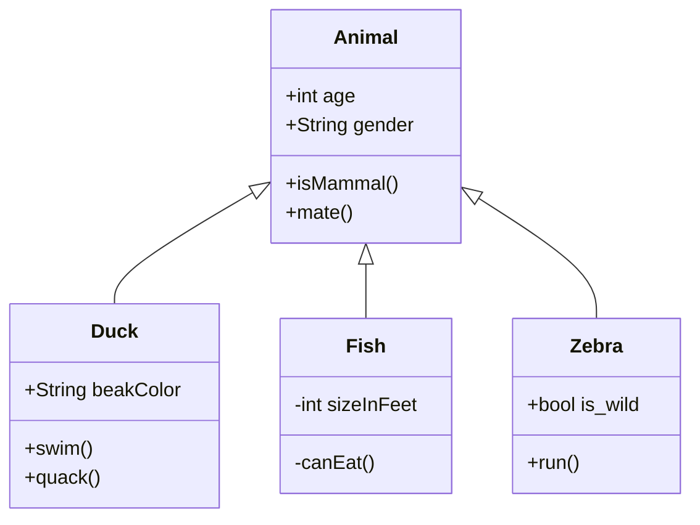
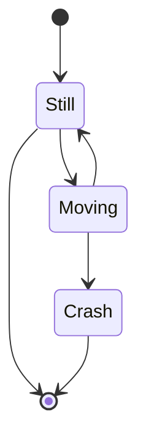

## 关于本笔记 
   2020年4月28日开始整理,之前的许多笔记十分杂乱无序。


## 目录结构

- ### SpringBoot相关

- ### Java零碎知识点

- ###  03-数据库相关操作
--  通用
--  MongoDB
--  MySql
--  Orace
--  PostgreSQL
--  Redis
--  未整理

- ### Linux 相关操作


- ### Shell脚本编程


- ### Cordova混合开发


- ### 正则表达式


 后续 

## 学习方向要点

**需要深入的技术点**：

**需要实践的技术点**：

**可以简单了解的技术点**：


## 资料
- [变量命名](https://unbug.github.io/codelf/)

### 网页与动画


### JavaScript

<!-- 语法基础：

DOM编程：

提升篇：

ES6篇：

Vue：

React:

综合： -->

### Node书籍


## 附录：笔记汇总


**OverNote分类**：  


Markdown 列表
Markdown 支持有序列表和无序列表。
无序列表使用星号(*)、加号(+)或是减号(-)作为列表标记： 

 有序列表使用数字并加上 . 号来表示，如：

 列表嵌套

 列表嵌套只需在子列表中的选项添加四个空格即可：

 区块是可以嵌套 >






```mermaid
pie title Pets adopted by volunteers
"Dogs" : 386
"Cats" : 85
"Rats" : 15